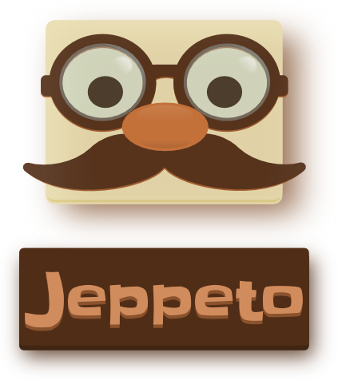

.. Jeppeto documentation master file, created by
   sphinx-quickstart on Wed Oct  5 12:08:35 2022.
   You can adapt this file completely to your liking, but it should at least
   contain the root `toctree` directive.

.. _jeppeto_index:

Editor de Jogos Jeppeto
=============================
 |Jeppeto|

Editor gráfico de jogos hospedados na internet.

  |python| |license| |github| |docs|

:Author:  Carlo E. T. Oliveira
:Version: 22.10
:Affiliation: Universidade Federal do Rio de Janeiro
:License: GNU General Public License v3 or later (GPLv3+)
:Homepage: `Editor de Jogos Jeppeto`_
:Changelog: `CHANGELOG`_

Jeppeto - Editor Gráfico de Jogos
---------------------------------

Este projeto visa a construção de um engenho computacional, capaz de possibilitar a criação de aulas vivas através
de jogos e objetos de aprendizagem interativos integrados às orientações curriculares do ensino fundamental,
implicando no alcance das seguintes metas:

* Construir um engenho computacional, a partir de ambientes já existentes desenvolvidos pela UFRJ, como jogos,
  objetos de aprendizagem interativos, suprindo a Plataforma de Educação Digital com este recurso integrado.

* Possibilitar a criação de aulas vivas, que utilizem jogos interativos, simulações e cenários animados
  e seja uma produção lúdica que de maneira fácil e gradativamente empoderante permita o gerenciamento
  e a intervenção do professor para desafiar o aluno a trilhar os seus próprios passos e até mesmo possibilitar
  os alunos incentivar e abrasar seus colegas com suas próprias aventuras no conhecimento.

.. toctree::
   :maxdepth: 2
   :caption: Conteúdo:

   intro.rst
   user.rst
   modules.rst

.. _Editor de Jogos Jeppeto: http://jeppeto.activufrj.nce.ufrj.br

.. _CHANGELOG: https://github.com/labase/jeppeto/blob/master/CHANGELOG.rst

.. |rtfd| image:: https://readthedocs.org/projects/supyplay/badge/?version=latest
   :target: https://supyplay.readthedocs.io/en/latest/

.. |github| image:: https://img.shields.io/github/v/release/labase/jeppeto?include_prereleases
   :target: https://github.com/labase/jeppeto/releases

.. |python| image:: https://img.shields.io/github/languages/top/labase/jeppeto
   :target: https://www.python.org/downloads/release/python-3107/

.. |docs| image:: https://img.shields.io/readthedocs/jeppeto
   :target: https://jeppeto.readthedocs.io/en/latest/index.html

.. |license| image:: https://img.shields.io/github/license/labase/jeppeto
   :target: https://github.com/labase/jeppeto/blob/master/LICENSE

.. include:: foot.rst